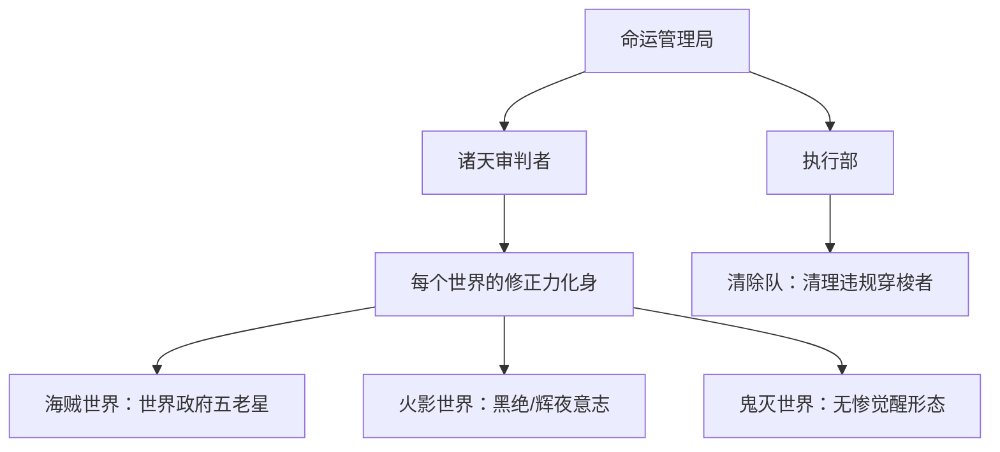

# 《动漫：开局顶上战争，暴打赤犬》小说总档案

最后更新：2026-06-01
正史范围：`E:\Users\李威\Documents\New project\XiaoShuo` 当前第1章至第23章。
正史优先级：`XiaoShuo` 已写章节 > 现有审查报告 > 总大纲 > 原始目录旧稿。

## 一、作品定位

书名：《动漫：开局顶上战争，暴打赤犬》

一句话简介：别人穿越诸天苟着发育，林夜开局就骑脸输出，专治各种意难平。

类型标签：男频爽文、动漫衍生、诸天流、神级选择、名场面改写、暴打反派 、拯救意难平 、诸天碾压·意难平终结流 。

核心路线：林夜穿越诸天动漫世界，觉醒神级选择系统。每进入一个关键名场面，系统给出选择。选择越狂，奖励越强。林夜专门改写原著里让读者憋屈的剧情：救艾斯、救宇智波、救炎柱、救自来也、救宁次、救五条悟。原剧情越惨，他改得越爽。

核心读者期待：

- 开局直接进名场面，不铺垫现实废话。
- 主角知道原剧情，并有实力撕剧本。
- 原著必死角色被救，反派被当众打脸。
- 原著人物震惊、认可、感谢主角。
- 每个世界都有一个明确爆点，不能写成流水账。
- 爽点必须当章兑现，不能连续几章只压危机不释放。

## 二、爽文执行铁律

这本书是爽文，后续每章必须按以下标准写：

- 开头给危机：敌人出手、名场面将崩、舆论爆炸、身份危机、规则压迫，不能闲聊太久。
- 中段给破局：系统、剧情情报、太阳神火焰、霸气、写轮眼、日之呼吸等金手指至少有一项参与解决危机。
- 后半给爽点：打脸、反杀、救人、揭真相、夺资源、敌人破防、原著人物认可，至少兑现一个。
- 结尾给钩子：新敌人、新任务、新反扑、世界修正力、下一个名场面，必须让读者想点下一章。
- 主角可以强，但不能让危机完全消失；强敌可以被打爆，长期阴谋和更高层敌人要继续加压。
- 原著人物负责震惊、辅助、情绪和见证；林夜负责破局、打脸、改命。
- 反派不能降智。被林夜压制时，要有合理动机：止损、试探、利用信息差、保住关键变量、转移战场。

推荐章节公式：危机出现 → 系统或情报触发 → 林夜选择最狂路线 → 奖励即时到账 → 金手指参与破局 → 当章爽点兑现 → 副本/阶段结算或更高危机浮出。

## 三、主角档案

姓名：林夜。

年龄：二十岁左右。

身份：穿越者，神级选择系统宿主，诸天名场面改写者，动漫世界最大变数。

性格：冷静、果断、嘴毒、不憋屈、不圣母、有底线。能动手绝不废话，能打脸就当场打，遇到意难平角色会救，但不是跪舔原著人物。

人设关键词：剧情破坏者、意难平终结者、掀桌流主角、诸天剧本撕裂者。

常用语气：

- “原剧情？不好意思，从现在开始，它不算了。”
- “我来了，就没有意难平。”
- “你算什么东西，也配……”
- “选择三。”

主角当前状态：

- 已完成海贼世界顶上战争副本。
- 已完成火影世界宇智波灭族夜副本。
- 已进入鬼灭世界，完成无限列车第一阶段，当前推进到花街上弦之陆战斗。
- 当前最新停点：第23章结尾，林夜用火圈困住堕姬和妓夫太郎，火圈外出现一股更古老、更接近鬼之本源的气息，疑似无惨相关干预或更高层鬼族压力。

## 四、金手指规则

### 1. 神级选择系统

每进入关键名场面，系统自动触发选择。选择越怂，奖励越低；选择越狂，奖励越强。林夜确认选择后，该选项对应奖励会立刻发放，并可马上参与当章危机破局。副本或阶段结束时，系统仍会根据整体改写程度进行结算评分，额外发放结算奖励、世界锚点或跨世界保留能力。

已确认系统能力：

- 发布名场面任务。
- 给出三个选择。
- 确认选择后，立刻发放该选项对应奖励。
- 按副本或阶段整体改写程度发放结算奖励。
- 提示倒计时、关键人物、威胁源。
- 结算副本评分。
- 发放跨世界保留能力和世界锚点。

系统限制：

- 改写名场面会引发世界线反扑。
- 改写程度越大，后续危机越强。
- 某些关键变量不能随意抹除，例如黑胡子、带土、黑绝、斑复活线、无惨线，否则可能导致世界线崩塌或后续卷缺少支点。
- 系统奖励不能乱堆。每卷最好只有一个核心能力，最多两个辅助能力。
- 即时奖励用于当章破局和爽点兑现，结算奖励用于卷末或阶段性爆发，两者不能混写成同一笔奖励。

### 2. 当前能力清单

海贼世界保留能力：

- 太阳神火焰模板，融合度40%。
- 太阳之环：以自身为中心释放环形火焰冲击波。
- 武装色霸气精通。
- 武装色缠绕·太阳纹：武装色与太阳神火焰融合，形成物理打击和高温灼烧复合攻击。
- 见闻色霸气精通。
- 霸王色霸气初级。

火影世界获得能力：

- 永恒万花筒写轮眼，已激活并确认保留。
- 须佐能乎·初始形态，已实战验证。
- 须佐能乎后续形态解锁权限，待瞳力提升后逐步解锁。
- 火遁强化：全火遁忍术威力提升200%，目前主要适用于查克拉世界。
- 幻术抗性：免疫万花筒级别以下所有幻术。
- 神威空间感知碎片1/3：可感知神威空间入口与空间坐标，集齐三片后可自由进出神威空间。
- 副本任务结算权限。
- 世界锚点：火之国火之寺后山坐标，可返回火影世界一次。

鬼灭世界当前能力：

- 日之呼吸完整版，十二式已解锁并在无限列车一役升格为肌肉记忆。
- 斩鬼之刃，配合太阳神火焰和日之呼吸使用。
- 太阳神火焰对鬼族特攻加成已提升至400%。
- 世界锚点·无限列车已记录，可返回鬼灭世界一次。
- 日之呼吸·第十三型觉醒进度已开启。

### 3. 能力边界

- 太阳神火焰不属于恶魔果实体系，也不属于查克拉体系；暗暗果实只能部分吸收，速度跟不上高强度输出。
- 太阳神火焰和霸气可绕过部分查克拉探测与封印，但不能写成完全免疫所有忍界规则，否则会破坏悬念。
- 见闻色能感知传谣路线、杀意、空间波动和部分异常气息，但不能凭空知道未发生、未观察到的私密对话。
- 霸王色可压服普通人、传信者、低阶敌人，但不能替代政治处理和舆论修复。
- 永恒万花筒可看穿空间坐标，配合火焰压制神威；但神威空间自由进出仍需集齐碎片。
- 鬼灭世界主角战力远超本土敌人，必须用环境变量、平民保护、无惨远程干预、世界线反扑来保持张力。

## 五、世界卷顺序

已写正史：

- 第一卷：顶上战争篇，第1-7章。核心爽点：救艾斯，暴打赤犬，揭穿黑胡子，阻止震震果实被夺，系统结算奖励大爆。
- 第二卷：宇智波灭族夜篇，第8-18章。核心爽点：救止水，反控团藏，保住宇智波，揭穿带土，当众撕下面具，获得永恒万花筒与须佐能乎。
- 第三卷：鬼灭世界篇，第19章开始。当前已写无限列车与花街，核心爽点：救炼狱、斩杀猗窝座、进军花街、当面嘲讽并碾压上弦之陆。

总大纲后续路线：

- 雨隐村救自来也篇：救自来也，硬撼佩恩六道，揭露带土和黑绝布局。
- 涉谷事变篇：救五条悟，破坏狱门疆封印，镇压咒灵，打爆真人。
- 第四次忍界大战篇：救宁次，打带土，提前破局无限月读。
- 奥特世界篇：获得光暗巨人力量。
- JOJO世界篇：觉醒时间系替身。
- 龙珠世界篇：获得赛亚人血脉。
- 诸天终局篇：所有被救角色反向支援林夜，对抗诸天审判者或命运管理局。

## 六、已写章节进度

| 章节 | 标题 | 章节功能 | 当前结果/钩子 |
|---|---|---|---|
| 第1章 | 开局顶上战争，暴打赤犬 | 系统绑定，选择暴打赤犬，太阳神火焰登场 | 林夜轰退赤犬，全场震惊 |
| 第2章 | 你算什么东西，也配评价白胡子？ | 正面替白胡子出头，压住赤犬话术 | 艾斯命运被第一步改写 |
| 第3章 | 这一拳，替艾斯还给你 | 冲上处刑台救艾斯 | 艾斯获救，海军沉默 |
| 第4章 | 火拳艾斯，活下去 | 艾斯不再回头送死，黑胡子提前暴露 | 林夜当众揭黑胡子老底 |
| 第5章 | 黑胡子，你也配？ | 暗暗果实克制失败，黑胡子计划被砸 | 海军不甘撤退，盯上林夜 |
| 第6章 | 三大将围攻，林夜不退 | 三大将围攻，林夜用火焰壁障脱困 | 顶上战争仍未彻底结束 |
| 第7章 | 系统结算，奖励大爆 | 顶上战争副本结算 | 进入火影，目标宇智波灭族夜 |
| 第8章 | 一把年纪偷小孩眼睛，你配叫木叶之暗？ | 林夜救止水，暴打团藏 | 永恒万花筒模板植入，倒计时7天 |
| 第9章 | 团藏自首，木叶炸锅 | 团藏被别天神反控自首，木叶与宇智波谈判 | 宇智波暂时保住，佐助命运改变 |
| 第10章 | 第六天，面具男现身 | 带土、大蛇丸、黑绝同时入局 | 带土信念动摇1%，三威胁确认 |
| 第11章 | 哥，教我手里剑术 | 鼬佐兄弟关系修复，大蛇丸目标被引导 | 灭族不会按原剧情发生 |
| 第12章 | 倒计时第四天，九尾之乱的真相 | 林夜拿到九尾卷轴，富岳得知宇智波被冤 | 带土决定引爆鸣人身份线 |
| 第13章 | 倒计时第三天，被遗忘的英雄之子 | 鸣人身份真相线，三代失职问责 | 建村纪念日公开身份，带土反向布局 |
| 第14章 | 倒计时第三天，面具男入局 | 谣言战当场反杀，传谣者被抓 | 带土改攻卡卡西旧伤 |
| 第15章 | 倒计时第二天，永恒之瞳焚神威 | 稻火被策反，林夜初战带土，永恒万花筒激活 | 系统选择三：灭族夜当众揭穿面具 |
| 第16章 | 灭族夜，当众撕下面具 | 须佐能乎首秀，面具被撕 | 带土真实身份暴露：宇智波带土 |
| 第17章 | 让真相站在光里 | 带土被压制，交代斑复活与黑绝布局 | 火影副本主线完成，鬼灭预告开启 |
| 第18章 | 火影告别与世界锚点 | 建村纪念日公开，林夜告别宇智波并获得世界锚点 | 抵达无限列车，选择独自解决猗窝座 |
| 第19章 | 无限列车上的太阳 | 魇梦被迅速压制，猗窝座登场 | 猗窝座砸穿车顶登场 |
| 第20章 | 上弦之叁的末路（上） | 林夜与猗窝座高强度交手 | 林夜斩断猗窝座右臂，猗窝座震惊 |
| 第21章 | 黎明的太阳，烧尽恶鬼 | 猗窝座被林夜钉在黎明阳光下焚毁，炼狱存活，全员生还 | 林夜主动寻找无惨，鬼灭主线继续扩展 |
| 第22章 | 花街的华丽与不华丽的鬼 | 进入吉原花街，锁定堕姬和妓夫太郎 | 林夜选择正面碾压 |
| 第23章 | 你的脸和你的实力一样不够看 | 林夜当面嘲讽堕姬，压制上弦之陆姐弟 | 更接近鬼之本源的气息靠近 |

## 七、主要人物关系与知情范围

### 林夜

知道海贼、火影、鬼灭等原剧情。知道黑胡子变量、带土真身、黑绝操盘、斑复活计划、无惨与上弦体系。当前要避免直接把所有真相一次性告诉所有人，必须遵守场景需要和知情边界。

### 艾斯

已被林夜救下，知道林夜是救命恩人。性格从原剧情冲动回头送死，转为愿意活下去。后续可作为跨世界支援角色。

### 白胡子

认可林夜胆量和实力。顶上战争中因为林夜介入，没有被黑胡子成功捡漏。可作为早期最大牌面背书。

### 黑胡子

当前未死，是系统确认的世界关键变量。夺取震震果实计划失败，短期被林夜打出恐惧，但仍是海贼世界后续反扑点。

### 赤犬/战国/海军

赤犬被林夜多次打脸，战国把林夜视作最大变数。海军没有彻底失败到失去体系，但威信受损。

### 鼬

已脱离原灭族命运，不再独自背负屠族罪名。当前倾向留在宇智波警务部，和止水、富岳一起处理根部余党和忍界后续危机。

### 止水

右眼保住，但别天神一段时间内不能使用查克拉。被林夜救下后成为宇智波稳定力量。右眼不再轻易交给别人。

### 佐助

当前是被改变命运的孩子，不再走原剧情复仇黑化路线。知道哥哥仍在身边，林夜答应等他成为火影时回来验收。

### 富岳

知道宇智波被冤、九尾之夜真凶与面具男有关，并在第16-18章确认带土身份。当前主线职责是带领宇智波从“被怀疑的家族”转为“主动讨回公道但不失控的家族”。

### 鸣人

知道自己是四代火影波风水门之子，不是妖狐。曾被要求短期保密，并在建村纪念日前后成为公开真相的核心人物之一。不能让幼年鸣人突然成熟或战力飞跃。

### 三代火影

知道自己对鸣人和宇智波均有失职。已经在火影线中面对真相压力。后续如果回火影世界，三代的重点不是继续狡辩，而是承担政治后果和修复木叶。

### 卡卡西

被带土旧伤线牵动。知道或即将知道带土存活与琳之死背后的复杂真相。后续可成为火影世界二次返回的重要情绪节点。

### 带土

真实身份已在灭族夜被揭穿。九尾之乱、月之眼、斑与黑绝布局已被迫暴露。当前不是彻底洗白，而是从“斑的面具”被打回“宇智波带土”。后续仍可作为复杂变量，而不是单纯工具人。

### 黑绝

真正长期操盘者。已暴露其与斑复活计划相关，但不能过早完全解决。当前适合作为跨卷暗线，负责推动世界线反扑。

### 炼狱杏寿郎

无限列车中存活。认可林夜的火焰与行动力。后续可成为鬼灭世界情绪支点和正道背书。

### 炭治郎/善逸/伊之助

已见证林夜压制鬼的力量。炭治郎能闻出林夜火焰和日之呼吸的特殊性；善逸负责恐惧与吐槽；伊之助负责战斗兴奋感。三人不能抢主角破局戏，但要提供原著人物震惊和情绪反馈。

### 宇髄天元

已在花街线出场，和林夜形成“华丽/不华丽”的吐槽互动。后续花街战斗中应让天元参与策应和救人，避免完全被主角边缘化。

### 堕姬/妓夫太郎

当前被林夜火圈压制，战力明显低于猗窝座。为了保持爽文爽点，可继续被打脸；为了保持危机，建议让平民、毒血、无惨干预或双鬼斩首条件成为压力来源。

### 猗窝座

正史中已被林夜在无限列车黎明前钉住，借阳光与太阳神火焰彻底斩杀。该处理回正总大纲“斩杀猗窝座”的爽点路线，也直接引发无惨震怒和上弦体系震动。

### 无惨

尚未正式正面出场。第23章结尾“更古老、更纯粹、更接近鬼之本源的气息”可作为无惨远程注视、分身干预、上位鬼支援或无限城信号，具体第24章再确认。

## 八、反派体系

前期已登场/已处理：

- 赤犬：海贼世界正面打脸对象，威严被击碎但未死。
- 战国：海军体系压力，负责不让主角轻易撤离。
- 黑胡子：关键变量，计划失败但保留后续反扑空间。
- 团藏：被林夜暴打并反控自首，木叶之暗牌面崩塌。
- 带土：从幕后面具男被打回真实身份，月之眼布局受重创。
- 大蛇丸：在火影线被引导转向斑的身体和秽土材料线。
- 魇梦：无限列车下弦之壹，被林夜快速处理。
- 猗窝座：上弦之叁，已被林夜借黎明阳光斩杀。
- 堕姬/妓夫太郎：当前战斗对象。

中长期反派：

- 黑绝：斑复活计划、辉夜线、世界暗线核心操盘者。
- 斑：火影世界后续忍界大战级威胁。
- 无惨：鬼灭世界真正鬼族源头。
- 假夏油/真人/漏瑚/宿傩：咒术卷核心反派。
- DIO、弗利萨、宇宙黑暗势力：后续世界卷反派。
- 诸天审判者、系统旧宿主、命运管理局：长期主线终局反派。

## 九、危机链

已完成危机链：

- 顶上战争危机：艾斯将死、赤犬羞辱白胡子、黑胡子等着捡漏。林夜用系统选择、太阳神火焰、霸气和剧情情报破局。
- 宇智波危机：止水夺眼、团藏灭族计划、木叶与宇智波互不信任、带土黑绝暗中推动。林夜用暴力打脸、信息揭露、见闻色、别天神反控、永恒万花筒和须佐能乎破局。
- 鸣人身份危机：英雄之子被当妖狐，带土利用舆论反推林夜提前公开。林夜保护鸣人、逼问三代、当街反杀谣言局。
- 带土身份危机：面具男试图止损灭口。林夜当众撕下面具，须佐能乎首秀，完成大爽点。
- 无限列车危机：魇梦入梦、猗窝座登场、炼狱原定死亡。林夜破解梦境，保住炼狱，当场斩杀猗窝座，全员生还。
- 花街危机：堕姬妓夫太郎双鬼，花街平民密集，双鬼分头战术。当前林夜正面压制，但更高鬼族气息靠近。

当前危机：

- 明面危机：上弦之陆姐弟尚未被斩杀，毒血、缎带、双鬼斩首条件仍可制造一轮压力。
- 环境危机：花街平民众多，建筑易塌，主角不能只顾打鬼，需保护普通人。
- 暗线危机：无惨或鬼之本源气息逼近，可能对战局进行远程注视、召回、精神压迫或派出更高层干预。
- 结构危机：第23章已经形成碾压局，第24章必须让“碾压爽”继续兑现，同时补一个更高级别压力，避免读者觉得上弦之陆太弱。

## 十、伏笔表

| 伏笔 | 埋设位置 | 当前状态 | 指向/回收建议 |
|---|---|---|---|
| 世界线反扑 | 第1章系统提示 | 加深中 | 每次救人后更强危机出现，长期指向诸天审判者 |
| 太阳神火焰不属于恶魔果实 | 第2章、第5章回收 | 已回收并持续有效 | 解释暗暗果实不能完全克制 |
| 黑胡子为关键变量 | 第4-5章 | 已埋，未终结 | 海贼世界后续反扑或跨世界变量 |
| 宇智波灭族倒计时 | 第8章起 | 已完成 | 第16-17章灭族夜被改写 |
| 止水右眼七天不能用 | 第12章 | 阶段性有效 | 限制别天神万能化 |
| 九尾之乱真相卷轴 | 第12章 | 已回收大半 | 带土身份、宇智波洗冤、鸣人身份公开 |
| 鸣人四代之子身份 | 第13章 | 已公开/已推进 | 后续可影响鸣人成长线和木叶舆论 |
| 卡卡西旧伤 | 第14-15章 | 部分回收 | 带土情绪破防线，可在返回火影时再挖 |
| 神威空间感知碎片1/3 | 第17章 | 已埋 | 后续集齐后自由进出神威空间 |
| 斑复活计划 | 第17章 | 已埋重磅长期线 | 指向未来忍界大战或回火影副本 |
| 世界锚点·火影 | 第18章 | 已获得 | 可回火影支援或处理斑/黑绝后续 |
| 世界锚点·无限列车 | 第21章 | 已获得 | 可回鬼灭收束无惨线 |
| 猗窝座伏诛 | 第21章 | 已回收 | 无惨震怒，上弦体系提前感到林夜威胁 |
| 日之呼吸第十三型 | 第22章 | 觉醒进度开启 | 建议在无惨相关危机时正式兑现 |
| 花街鬼之本源气息 | 第23章 | 当前最新钩子 | 第24章开头必须承接，不能忽略 |

## 十一、当前逻辑维护提醒

- 第11章曾有“团藏自首过去三天”和倒计时表达可能不严的问题；后续统一按已定主线处理：第12章倒计时第四天，第13-14章第三天，第15章第二天，第16章归零。
- 第18章系统吐槽已微调为“宿主行为记录”，弱化元叙述味道。后续系统吐槽可以保留毒舌，但不要提“读者、章节、大纲、爽点密度”等破墙词。
- 鬼灭篇存在战力降级问题：林夜从须佐能乎打带土后进入鬼灭，战力远超本土敌人。解决方式不是削主角，而是增加环境、人质、毒、无惨干预、鬼族规则和世界线反扑。
- 第21章已按总大纲回正为“斩杀猗窝座”。后续不要再安排猗窝座回归，鬼灭压力改由无惨震怒、上弦空缺、鬼族规则反扑和花街平民危机承接。
- 第22章奖励梯度已修补为“正面碾压奖励最高，撤退仅给辅助侦察奖励”。后续继续保持“越狂奖励越强”，不要让怂选项奖励看起来更香。
- 花街线不能只写林夜嘲讽局。第24章至少要有一个即时危机让林夜出手保护平民或压住无惨干预，爽点才更有力度。

## 十二、第24章承接方向

第24章开头必须承接第23章末句：火圈外有一股更古老、更纯粹、更接近鬼之本源的气息靠近。

推荐第24章功能：花街上弦之陆战斗兑现 + 无惨远程压迫初登场。

第24章必须包含：

- 危机：妓夫太郎毒血爆发、堕姬试图牵连平民，或无惨意志远程压迫双鬼，逼他们同归于尽式反扑。
- 金手指破局：林夜用见闻色提前感知毒血轨迹，用太阳神火焰烧尽毒血，用日之呼吸斩断双鬼再生链。
- 当章爽点：林夜当着天元、炼狱、炭治郎等人的面，正面斩首上弦之陆姐弟；堕姬破防，妓夫太郎第一次恐惧。
- 情绪回报：天元承认林夜的战斗方式“过分但华丽”；炭治郎震惊日之呼吸真正威力；炼狱认可林夜救人的方式。
- 结尾钩子：无惨感知到上弦之陆死亡或被压制，第一次正式记住“林夜”这个名字；也可以让无惨因猗窝座死亡后的上弦空缺提前收缩鬼族布局。

第24章不要做：

- 不要让无惨本体立刻亲自下场硬打，否则鬼灭篇升级太快。
- 不要让上弦之陆拖太久，花街线已经进入压制局，应该当章兑现斩鬼爽点。
- 不要让天元、炼狱、炭治郎等人只围观，至少给他们安排救平民、拦毒血、补刀、见证或情绪反应。
- 不要让林夜突然获得太多新能力。第十三型可以推进，但最好不要一章完全满级，留给无惨决战。

## 十三、后续长期写作方向

近期目标：

- 第24章收束上弦之陆，正式引出无惨压力。
- 第25章可写无惨震怒、上弦空缺、鬼杀队总部震动。
- 鬼灭篇中期目标是把“远超鬼灭世界的碾压爽”写成“救人效率拉满 + 鬼族高层恐惧 + 无惨被迫提前调整布局”。

中期目标：

- 鬼灭篇完成后，可按总大纲进入雨隐村救自来也篇，回收火影世界锚点和黑绝/斑复活伏笔。
- 回火影时必须让林夜面对更高层危机：佩恩六道、长门本体、黑绝暗线、斑复活。
- 咒术篇要把“封印五条悟”改成“狱门疆失败，假夏油启动备用计划”，保持名场面改写逻辑。

长期目标：

- 每个世界都不是孤立副本，林夜救下的人未来都能成为反向支援。
- 系统不是单纯发奖励，而是在培养能打破诸天剧本的人。
- 最终敌人不是某个单世界反派，而是维护原剧情必然性的诸天审判者或命运管理局。

## 十四、续写前检查清单

写新章前必须先查：

- 上一章最后一句是什么。
- 当前世界、当前时间、当前地点。
- 当前敌人是否还有未使用能力。
- 林夜当前能用哪些能力，哪些能力不能乱用。
- 本章危机来自哪里。
- 本章金手指如何参与破局。
- 如果本章出现系统选择，必须写清楚：确认选择 → 奖励到账 → 奖励如何参与破局或埋伏笔。
- 本章爽点在哪里兑现。
- 本章结尾钩子指向谁。
- 哪些角色知道真相，哪些角色不能越界知道。

写完后必须检查（强制流程）：

### 【第一步】即时自检（跑模板C）
使用《【模板】章节卡-写作提示词-自检清单·增强版.md》的【C. 即时自检清单】，对刚写完的章节逐条核查，输出P1/P2/P3修改清单。
- 伏笔是新埋、加深、回收还是失效。
- 当章是否有明确爽点兑现。
- 是否有画面感：动作、表情、环境、对话、心理波动。
- 是否有知情范围越界。
- 是否有时间线混乱。
- 是否让读者想看下一章。

---

## 十五、创作管理工具包

> 包含：章节卡模板、正文提示词、自检清单、连续性记录
> 对应文件路径：`E:\Users\李威\Documents\New project\XiaoShuo\【连续性记录】第8-14章完整存档.md`（宇智波篇）

### 工作流总览

```
总档案 → 章节卡（满意） → 正文提示词 → 写正文 → 自检 → 修改 → 更新连续性记录 → 下章章节卡
```

### 15.1 章节卡模板（每章必填）

复制以下模板，每章写前填写：

```
【章节卡 - 第X章】
1. 本章一句话目标：
2. 开头钩子（300字内出现危险/异常/倒计时/规则触发）：
3. 主要场景：
4. 本章核心冲突：
5. 关键线索：
6. 主角做出的选择：
7. 付出的代价：
8. 爽点/反转（必须具体）：
9. 结尾悬念（必须是具体事件，不能是总结）：
10. 不能违反的旧设定（来自本档案）：
11. 字数目标：XXXX字
```

### 15.2 正文提示词模板

```
你是番茄男频诸天流·神级选择爽文作者。

请根据以下章节卡，写第X章正文。

【章节卡内容】
[粘贴完整章节卡]

【写作要求】
1. 开头300字内必须出现：危险、异常、尸体、倒计时、规则触发或强烈矛盾
2. 不要慢热，不要大段解释世界观
3. 每隔2-3段制造一次小阻碍：误导线索、规则压力、队友质疑、身体代价、时间限制
4. 主角胜利必须来自观察、选择、代价、准备或利用已有规则
5. 对话必须推动冲突，禁止闲聊
6. 结尾必须留下具体悬念（一个事件），不能用总结收尾
7. 字数：约XXXX字
8. 风格：紧张、利落、商业网文节奏
9. 神级选择系统触发条件：遇到名场面或核心冲突时，屏幕出现三个选项
10. 选择越狂，奖励越丰厚；系统提前发放奖励
```

### 15.3 自检清单（写完必查）

```
请审查第X章正文，按以下10条标准逐一检查：

1. 开头300字内有没有给读者制造问题/危险/异常？
2. 本章主角目标是否清楚？
3. 中段是否有持续冲突，而不是原地解释？
4. 线索和推理是否从已有信息可以推出？
5. 主角有没有付出代价或承担风险？
6. 有没有违反旧规则、人物动机或时间线？
7. 爽点是否足够明确且有冲击力？
8. 结尾钩子是否够强（具体事件而非总结）？
9. 哪些段落水/可以删/可以压缩？
10. 修改优先级总结：
    [P1 必须改]：[具体位置+建议]
    [P2 建议改]：[具体位置+建议]
    [P3 可不改]：[具体位置+理由]
```

### 15.4 连续性记录更新模板（每章完稿后填）

```
## 第X章 完稿后连续性记录

### 时间线更新
- 本章结束时时间/状态：
- 下章需要接续时间：

### 人物状态快照
| 人物 | 本章变化 | 当前状态 |
|------|---------|---------|
| 林夜 | | |
| [其他相关人物] | | |

### 伏笔更新
| 伏笔 | 本章推进 | 待回收章节 |
|------|---------|----------|
| A | | |
| B | | |

### 本章新确立的设定：

### 下章必须处理的问题：
1.
2.
```

---

## 十六、连续性记录总览

> 详细存档见对应文件，此处仅记录关键节点和状态摘要

### 16.1 各卷时间线状态

**第一卷：顶上战争篇（第1-7章）**

```
顶上战争当天
第1章 → 第2章 → 第3章 → 第4章 → 第5章 → 第6章 → 第7章（副本结算）
```

**第二卷：宇智波灭族夜篇（第8-18章）**

```
灭族前第7天   → 第8章（进入副本，救止水，暴打团藏）
灭族前第6天   → 第9章（团藏自首，宇智波与木叶和解）
灭族前第5天   → 第10章（带土现身南贺川，信念动摇1%）
灭族前第5天夜 → 第11章（鼬佐训练，大蛇丸转向斑身体）
灭族前第4天   → 第12章（九尾真相卷轴）
灭族前第3天   → 第13章（鸣人身份，螺旋丸训练）
灭族前第3天夜 → 第14章（谣言战，带土给卡卡西留纸条）
灭族前第2天   → 第15章（初战带土，永恒万花筒激活）
灭族归零日    → 第16章（须佐能乎首秀，面具撕开）
灭族改写后    → 第17章（带土交代斑与黑绝）
建村纪念日    → 第18章（身份公开，林夜告别火影）
```

**第三卷：鬼灭之刃篇（第19-23章，已写完）**

```
无限列车抵达    → 第19章（魇梦被压制，猗猗座登场）
黎明前战斗      → 第20-21章（斩猗猗座，炼狱存活）
花街进入        → 第22章（锁定堕姬/妓夫太郎）
花街压制        → 第23章（林夜碾压上弦之陆）
鬼之本源气息靠近 → 第24章（待写）
```

### 16.2 第8-23章关键伏笔追踪

| 伏笔 | 埋设章节 | 状态 | 指向/回收 |
|------|---------|------|----------|
| 带土信念动摇 | 第10章 | 动摇1% | 第15-17章面具撕开时大幅推进 |
| 大蛇丸转向斑身体 | 第11章 | 已转向 | 指向斑复活/秽土转生线 |
| 九尾真相卷轴 | 第12章 | 已公开 | 带土身份、宇智波洗冤 |
| 鸣人四代之子身份 | 第13章 | 建村纪念日已公开 | 鸣人成长线 |
| 卡卡西旧伤 | 第14章 | 纸条已给 | 返回火影时可再挖 |
| 神威空间碎片1/3 | 第17章 | 已埋 | 集齐后自由进出神威空间 |
| 斑复活计划 | 第17章 | 已埋长期线 | 第四次忍界大战篇 |
| 世界锚点·火影 | 第18章 | 已获得 | 可返回处理斑/黑绝 |
| 世界锚点·无限列车 | 第21章 | 已获得 | 可返回收束无惨线 |
| 日之呼吸第十三型 | 第22章 | 觉醒进度开启 | 无惨相关危机时兑现 |
| 花街鬼之本源气息 | 第23章 | 当前钩子 | 第24章必须承接 |
| 无惨震怒/上弦空缺 | 第21章 | 已触发 | 第24-25章展开 |

### 16.3 当前卷人物状态快照（鬼灭·第23章末）

| 人物 | 状态 |
|------|------|
| 林夜 | 花街上弦之陆战斗，融合度40%+，日之呼吸肌肉记忆，太阳神火焰400%鬼族特攻 |
| 堕姬/妓夫太郎 | 被火圈压制，上弦之陆尊严崩塌 |
| 宇髓天元 | 花街线策应，负责华丽战斗和救人 |
| 炼狱杏寿郎 | 无限列车存活，当前在场见证 |
| 炭治郎/善逸/伊之助 | 见证林夜压制鬼之力 |
| 无惨 | 未正面出场，远程注视/意志压迫即将介入 |
| 猗猗座 | 已被第21章斩杀 |

### 16.4 未解决的P1/P2级问题（来自审查报告）

**P1级（必须改）：**

| 问题 | 位置 | 处理方案 |
|------|------|---------|
| 团藏右臂十只写轮眼与灭族未发生矛盾 | 第8章 | 改为根部此前外任务收集的2-3只写轮眼 |
| "团藏自首已过三天"与倒计时天数不符 | 第11章 | 改为"一天" |

**P2级（建议改）：**

| 问题 | 位置 | 处理方案 |
|------|------|---------|
| 大蛇丸被三言两语说服，缺乏内心挣扎 | 第11章 | 增加大蛇丸拷问林夜情报来源场景 |
| 旁白过早暴露黑绝"辉夜意志化身"身份 | 第12章 | 改为"某个极古老的意志体" |
| 太阳神火焰"免疫查克拉"设定破坏悬念 | 贯穿全文 | 明确限制：免疫感知但需避免声音/光影暴露 |


## 十七、诸天穿越规则

### 17.1 穿越触发条件

林夜的诸天穿越由神级选择系统自动管控，主要有三种触发情形：

1. **副本自然结束**：当林夜在一个动漫世界完成主体名场面改写、系统结算完毕后，自动开启下一个副本。此时可短暂回归现实休整（约现实24小时）。
2. **副本中途强制传送**：若林夜在副本中触犯"不可修改的核心锚点"（如试图直接抹除该世界最终BOSS导致世界线崩溃风险），系统会启动紧急保护将林夜强行传送出去，但该副本后续无法自由返回。
3. **主动使用世界锚点**：林夜在每个完成的副本可获得一个"世界锚点"，可以在后续任意时间主动消耗锚点重返该世界一次。（已获得：火影世界的火之寺后山、鬼灭世界的无限列车车厢）

### 17.2 能力携带与衰减规则

为了保证各世界的平衡性与剧情张力，系统对跨世界能力有以下限制：

| 能力类型 | 携带规则 | 说明 |
|---|---|---|
| 核心能力（法则/血脉级） | 全部永久保留 | 太阳神火焰、永恒万花筒写轮眼、日之呼吸法等核心能力在所有世界都可正常使用。 |
| 通用型能力（能量运用） | 全环境可用但有衰减 | 三色霸气、仙术查克拉等在大多数世界都能使用，但在特殊世界观下会有20%-50%效果衰减。 |
| 本土非核心技能 | 仅限本世界稳定使用 | 从单个世界内获得的非核心特殊技能，在离开该世界后会迅速退化至入门水准。 |

> **注**：目前主角的日之呼吸已达肌肉记忆层次，所以在鬼灭世界可以完美发挥；但若未来去到完全不用呼吸法的科幻世界可能会暂时性失去招式威力——届时会成为合理的暂时的实力瓶颈来源之一。

### 17.3 时间流速差异说明

目前默认各个世界内部的时间流逝速度与现实基本一致。为避免情节漏洞，设定如下：

- 每次进入新世界时均有至少半天左右的调整缓冲期给林夜熟悉环境并做初步规划；
- 不同世界之间的切换存在不确定的冷却期使得外界感知不到明显的时间错位；
- 后续若需引入时间流速差异（如"一天=一年"修炼情节），必须经过系统明确提示并告知读者。

---

## 十八、系统深层机制（待回收伏笔）

### 18.1 系统的真正目的

系统中期或第10卷揭露：它不是随机绑定普通人，而是在培养能够打破诸天剧本的人。

**背景设定**（暂不写入正文，仅作作者参考）：

- 数十年前曾有旧宿主尝试打破命运管理局但失败；
- 林夜被选中的原因是他灵魂波长与旧宿主有共鸣；
- 系统本身也是命运管理局创造出来的"测试工具"，但产生了自主意识。

**回收时机**：建议在第四或第五卷通过神秘NPC/遗迹铭文/幻境考验等方式逐步透露信息。

### 18.2 敌方反派组织预设架构图（供长远规划参考）



> ***此架构可根据实际写作需要调整成员名单。***

---

*本档案为全书正史唯一维护源。章节完成后必须同步更新本文件第十四至十六节内容。*

